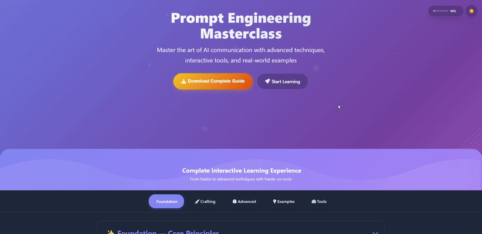

# 🌐 Prompt Engineering Lecture  

  
  

**✨ Tagline:** *Learn, Create, and Master the Art of Professional Prompting for AI*  

---

## 📑 Table of Contents
1. [Overview](#-overview)  
2. [Core Features](#-core-features)  
3. [Why Choose This Platform?](#-why-choose-this-platform)  
4. [How It Works](#-how-it-works)  
5. [Demo Preview](#-demo-preview)  
6. [Tech Stack](#-tech-stack)  
7. [Get Started](#-get-started)  
8. [Changelog & Updates](#-changelog--updates)  
9. [Disclaimer](#-disclaimer)  

---

## 🚀 Overview  
**Prompt Engineering Lecture** is a **free, educational web platform** built to introduce learners to the fundamentals of prompt engineering and its practical applications.  

- **🎯 Purpose:** Build a strong foundation in crafting professional prompts.  
- **👩‍🎓 Audience:** Students, beginners, and AI enthusiasts.  
- **💸 Cost:** 100% free and globally accessible.  

---

## ✨ Core Features  
- **📚 Foundations & Basics** – Learn essential prompt engineering concepts.  
- **⚡ Prompt Generator** – Create and test prompts interactively.  
- **🧩 Advanced Techniques** – Explore methods such as *Chain-of-Thought* and *K-shot prompting*.  
- **📝 Learning Resources** – Tutorials, examples, and structured guides.  
- **📂 Prompt Libraries** – Ready-to-use prompts for experimentation.  

---

## 💡 Why Choose This Platform?  
✔️ Hands-on interactive learning materials  
✔️ Simple explanations paired with practical examples  
✔️ Curated **best practices & rules of thumb**  
✔️ Beginner-friendly onboarding with a clear roadmap  

---

## 🖥️ How It Works  
1. 🌐 Visit the platform.  
2. 📖 Explore tutorials, guides, and libraries.  
3. 🛠️ Generate prompts and practice instantly.  

---

## 🖼️ Demo Preview  
  

---

## ⚡ Tech Stack  
- **Frontend:** HTML, CSS, JavaScript  
- **Design:** Lightweight, responsive, and optimized for all devices  

---

## 🔗 Get Started  
👉 Visit: [Prompt Engineering Lecture](https://prompt-engineer-lecture.vercel.app/)  
📌 Start learning today and **become proficient in crafting prompts!**  

---

## 📢 Changelog & Updates  

### ✅ Fixes & Improvements  
- Restored missing icons across the platform.  
- Added **reading progress tracker** (sections marked as read + progress bar).  
- Introduced **Clear Inputs** button.  
- Editable **example prompts** for quicker practice.  
- **Copy button** only appears for user-generated prompts.  
- Fixed **PDF export** issues with special characters (€, £, Ø, etc.).  
- Improved bullet alignment & spacing in *Core Principles* and *Storytelling* sections.  

### 📱 Mobile Experience  
- Tabs (Foundation, Crafting, Advanced, Examples, Tools) optimized for small screens.  
- Input fields remain inside containers.  
- Example previews are compact and expandable.  
- Removed excess spacing for smoother layouts.  
- Overall UI more responsive across devices.  

### ✨ New Features  
- **Advertisement section** with *Start Learning* button linking to Claude AI official site.  
- Smooth scrolling enabled for cleaner navigation.  

---

## 📘 Disclaimer  
This project is developed **for educational purposes only**.  

---
